# ☀️ LG ESS Solar Card für Home Assistant

Eine moderne, animierte Energiefluss-Visualisierung, Batterie-Statusanzeige und Schnellsteuerung für **LG ESS Solar-Wechselrichter & Batteriespeicher** in Home Assistant Lovelace.


<p align="center">
  
</p>

---

## ✨ Features

* **⚡ Energiefluss wie im offiziellen Home Assistant Energy Dashboard:**
  * **Original 4-Knoten-Layout:** Solar ☀️ (oben), Netz ⚡ (links), Haus 🏠 (rechts) und Batterie 🔋 (unten).
  * **Exakte geschwungene SVG-Kurven & Verbindungslinien** identisch zum HA-Standard.
  * **Fließende Partikel (Animated Motion Dots):** Energiefluss-Punkte gleiten entlang der Pfade; die Flussgeschwindigkeit skaliert dynamisch mit der Leistung (schneller bei hoher Leistung).
  * **Mehrfarbiger Energie-Mix-Ring um das Haus:** Visuelle Aufteilung des aktuellen Verbrauchs nach Solarenergie, Batteriespeicher und Stromnetz.
* **🔋 Batterie-Visualisierung:**
  * Dynamisches Batterie-Icon mit Lade-Symbol und Füllstand (0–100 %).
  * Anzeige von Lade- und Entladeleistung mit Pfeil-Indikatoren in Echtzeit.
* **☀️ PV-Strings Detailschublade:**
  * Aufklappbare Übersicht für **String 1, String 2 und String 3** mit Einzelleistungen (kW/W) und String-Spannungen (V).
* **📊 Tagesstatistiken & KPIs (Theme-integriert):**
  * Kreisförmige Ring-Anzeige für **Autarkiegrad (%)** und **Eigenverbrauchsrate (%)**.
  * Tagesübersicht: Erzeugte Solarenergie, Hausverbrauch, Netzeinspeisung und Netzbezug.
* **❄️ Schnellsteuerung integriert:**
  * Direkte Umschalt-Buttons für **Wintermodus** und **Schnellladung** mit Live-Rückmeldung.
* **🪄 Zero-Config Auto-Erkennung:**
  * Erkennt automatisch alle Sensoren des [LG ESS Add-ons](https://github.com/Buktahula/hassio-addons/tree/main/LG_ESS) – egal ob `entity_naming: legacy` (z. B. `sensor.actual_grid_buy`) oder `modern` (z. B. `sensor.aktueller_netzbezug`) eingestellt ist!
* **🎨 100 % Home Assistant Theme-kompatibel:**
  * Verwendet native HA-CSS-Variablen (`--energy-solar-color`, `--energy-battery-in-color`, `--energy-battery-out-color`, `--energy-grid-consumption-color`, `--energy-grid-return-color`).
  * Passt sich jedem installierten Home Assistant Theme (Dark & Light) nahtlos an.
* **📱 Responsiv & Interaktiv:**
  * Klick auf einen Knoten öffnet das Standard Home Assistant `more-info` Dialogfenster.
  * Inklusive grafischem Lovelace-Editor im Dashboard.

---

## 🚀 Installation

### Option 1: Über HACS (Empfohlen)
1. Öffne **HACS** in Home Assistant.
2. Klicke oben rechts auf das Drei-Punkte-Menü (`...`) ➔ **Benutzerdefinierte Repositories**.
3. Trage die Repository-URL ein: `https://github.com/buktahula/lg-ess-card`
4. Wähle als Typ: **Dashboard** (oder *Lovelace*).
5. Klicke auf **Hinzufügen** und installiere die Karte.
6. Lade dein Dashboard einmal neu.

---

### Option 2: Manuelle Installation
1. Lade [`lg-ess-card.js`](lg-ess-card.js) herunter.
2. Kopiere die Datei in deinen Home Assistant Konfigurationsordner unter `config/www/lg-ess-card.js`.
3. Gehe in Home Assistant zu **Einstellungen ➔ Dashboards ➔ Drei Punkte oben rechts ➔ Ressourcen**.
4. Klicke auf **Ressource hinzufügen**:
   * **URL:** `/local/lg-ess-card.js`
   * **Ressourcentyp:** `JavaScript-Modul`
5. Speichern und Browser einmal aktualisieren.

---

## 🛠️ Verwendung im Dashboard

### 1. Minimal-Konfiguration (Zero-Config)
Dank automatischer Sensor-Erkennung genügt eine einzige Zeile:

```yaml
type: custom:lg-ess-card
```

---

### 2. Vollständige Konfiguration (mit Anpassungen)

```yaml
type: custom:lg-ess-card
title: "Mein LG ESS Speicher"
power_unit: "kW" # "kW" (Standard) oder "W"
show_strings: true # PV-Strings Detailschublade anzeigen (true/false)
show_stats: true # Tagesstatistiken (Autarkie, Eigenverbrauch) anzeigen (true/false)
show_controls: true # Schalterleiste (Wintermodus, Schnellladung) anzeigen (true/false)

# Optional: Manuelle Entitäten-Übersteuerung (nur nötig bei abweichenden Namen)
entities:
  pv_total: sensor.actual_generation_pv_full
  battery_soc: sensor.battery_load_percent
  house_consumption: sensor.actual_consuming_house
  grid_buy: sensor.actual_grid_buy
  grid_sell: sensor.actual_grid_sell
  switch_winter_mode: switch.winter_mode
  switch_fastcharge: switch.fastcharge
```

---

## 📋 Alternative: Fertiges YAML-Dashboard mit Standard-Karten

Falls du (noch) keine Custom Cards installieren möchtest, kannst du folgende fertige Kombination aus Home Assistant Standard-Karten nutzen:

```yaml
type: vertical-stack
cards:
  # 1. Kopfzeile mit Status
  - type: horizontal-stack
    cards:
      - type: tile
        entity: sensor.operation_mode
        name: LG ESS Modus
        icon: mdi:solar-power-variant
      - type: tile
        entity: sensor.battery_load_percent
        name: Akku-Ladestand
        color: green

  # 2. Live-Leistungswerte (Kacheln)
  - type: grid
    columns: 2
    square: false
    cards:
      - type: tile
        entity: sensor.actual_generation_pv_full
        name: Solarproduktion
        color: amber
        icon: mdi:solar-power
      - type: tile
        entity: sensor.actual_consuming_house
        name: Hausverbrauch
        color: purple
        icon: mdi:home-lightning-bolt
      - type: tile
        entity: sensor.actual_battery_charge
        name: Batterieladung
        color: cyan
        icon: mdi:battery-charging-wireless
      - type: tile
        entity: sensor.actual_grid_buy
        name: Netzbezug
        color: deep-orange
        icon: mdi:transmission-tower-import

  # 3. Tages-Autarkie & Eigenverbrauch (Gauges)
  - type: horizontal-stack
    cards:
      - type: gauge
        entity: sensor.solaredge_calculated_self_sufficiency
        name: Autarkiegrad
        min: 0
        max: 100
        needle: true
        severity:
          green: 75
          yellow: 40
          red: 0
      - type: gauge
        entity: sensor.energy_day_self_consumption_rate
        name: Eigenverbrauch
        min: 0
        max: 100
        needle: true
        severity:
          green: 70
          yellow: 40
          red: 0

  # 4. Schnellschalter
  - type: horizontal-stack
    cards:
      - type: tile
        entity: switch.winter_mode
        name: Wintermodus
        color: light-blue
        icon: mdi:snowflake
      - type: tile
        entity: switch.fastcharge
        name: Schnellladung
        color: amber
        icon: mdi:battery-charging-wireless-alert
```

---

## 📄 Lizenz
MIT License © 2026 buktahula
